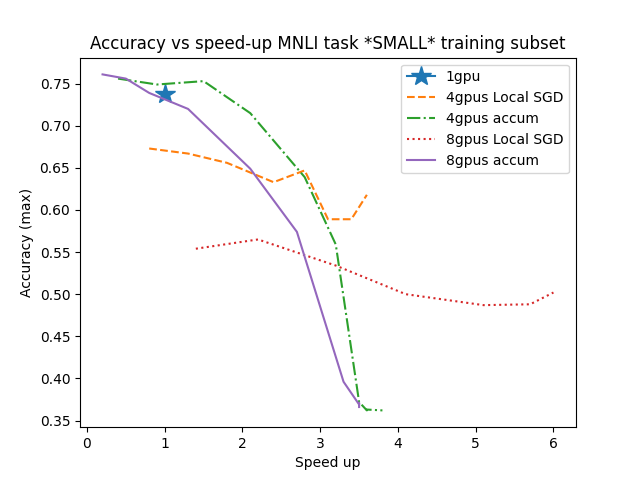

## Overview
A summary of results for QA and MNLI case. The models were trained on G5 AWS instances using different subses. 
- A small subset had 4K entries and the large one had at most 40K. We tried both FP16 and BF16 float-poing modes, but they performed similarly. Parallel training was carried out using HuggigngFace accelerate library extended to support LocalSGD. 
- As a baseline we usde single-GPU training and training with gradient accumulation (which makes synchronization steps less frequent, but increases an effective batch size). 
- Each model was trained three times using different seeds.
- For gradient accumulation, [as recommended](https://huggingface.co/docs/accelerate/concept_guides/performance), the batch size was adjusted for the number of GPU so that the global batch size remains unchanged.
- We slightly changed the learning rate for Local SGD, but the batch size remained the same.
- The scripts to reproduce results are in this directory (there are also easy-to-find notebooks to process results):
  * [Installation](install_main.sh)
  * [Test MNLI](run_mnli_main.sh)
  * [Test SQUAD](run_qa_main.sh)

## Tables and plots
If you click on the image, you can download Excel files with more detailed tables. Note that for XNLI we remove a few datapoints where performance was too low. 

 

 

## A brief discussion of results

It is not hard to see the following:
1. When a model is trained with multiple GPUs in many cases there is loss in either efficiency or effectiveness.
2. There can be modest or even no loss for larger datasets and 4 GPUs, yet, when we use 8 GPUs, a loss is more substantial.
3. With four GPUs and larger sets both LocalSGD and gradient accumulation can perform quite well: 
  - For MNLI and close-to-4x speed ups, LocalSGD is better.
  - For QA both LocalSGD and the gradient accumulation are equally accurate, but surprisingly with gradient accumulation we can bigger than 4x speed up (it is not quite clear how/whi this happens though)
4. For QA we get great results (same accuracy as single-GPU training) even with 8 GPUs, but not for MNLI
5. For larger datasets, in terms of accuracy at usuable speed ups (~4x for 4 GPUs and ~8x for 8 GPUs), Local SGD is at least as accurate as Local SGD.
6. For QA and gradient accumulation surprisingly we exceed the theoretically possible speed up, but for MNLI the speed up for gradient accumulation somehow saturates at 4x. We think the latter can be due to a very small per device batch size that does not permit loading GPUs properly (we can increase these batch sizes somewhat, but we did not test how it would affect accuracy).
